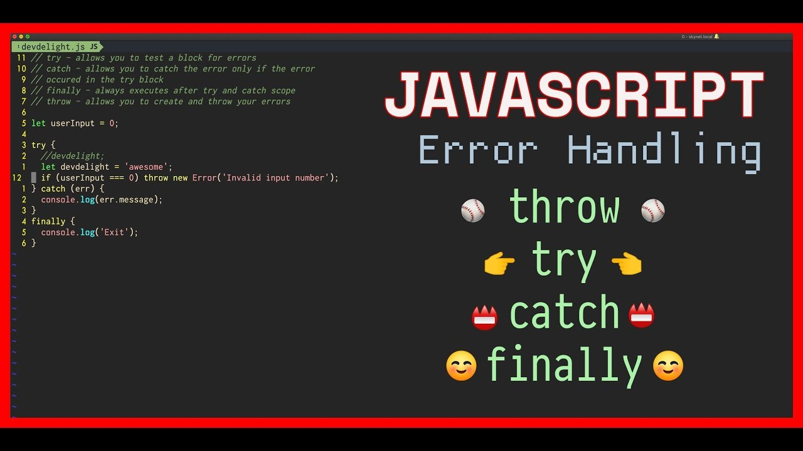
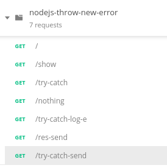

# Lançando erros em Node.js

Brincando de lançar execções em Nodejs + Express.

### JavaScript/Reference/Statements/throw

https://developer.mozilla.org/pt-BR/docs/Web/JavaScript/Reference/Statements/throw

### API Postman

Use o [Postman](https://www.getpostman.com/), exporte o arquivo
 `nodejs-throw-new-error.postman-collection.json`.

